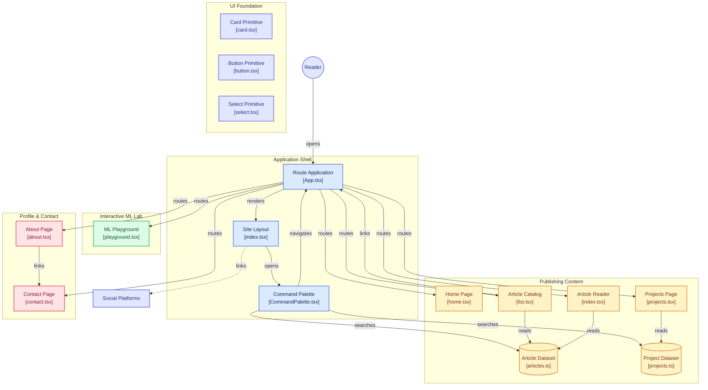

```mermaid

flowchart TD

subgraph group_shell["Application Shell"]
  node_app["Route Application<br/>[App.tsx]"]
  node_layout["Site Layout<br/>[index.tsx]"]
  node_palette["Command Palette<br/>[CommandPalette.tsx]"]
end

subgraph group_publishing["Publishing Content"]
  node_home["Home Page<br/>[home.tsx]"]
  node_article_list["Article Catalog<br/>[list.tsx]"]
  node_article_reader["Article Reader<br/>[index.tsx]"]
  node_article_data[("Article Dataset<br/>[articles.ts]")]
  node_projects["Projects Page<br/>[projects.tsx]"]
  node_project_data[("Project Dataset<br/>[projects.ts]")]
end

subgraph group_lab["Interactive ML Lab"]
  node_playground["ML Playground<br/>[playground.tsx]"]
end

subgraph group_profile["Profile &amp; Contact"]
  node_about["About Page<br/>[about.tsx]"]
  node_contact["Contact Page<br/>[contact.tsx]"]
end

subgraph group_ui["UI Foundation"]
  node_card["Card Primitive<br/>[card.tsx]"]
  node_button["Button Primitive<br/>[button.tsx]"]
  node_select["Select Primitive<br/>[select.tsx]"]
end

node_reader(("Reader"))
node_social["Social Platforms"]

node_reader -->|"opens"| node_app
node_app -->|"renders"| node_layout
node_app -->|"routes"| node_home
node_app -->|"routes"| node_article_list
node_app -->|"routes"| node_article_reader
node_app -->|"routes"| node_projects
node_app -->|"routes"| node_playground
node_app -->|"routes"| node_about
node_app -->|"routes"| node_contact
node_layout -->|"opens"| node_palette
node_palette -->|"searches"| node_article_data
node_palette -->|"searches"| node_project_data
node_palette -->|"navigates"| node_app
node_article_list -->|"reads"| node_article_data
node_article_list -->|"links"| node_app
node_article_reader -->|"reads"| node_article_data
node_projects -->|"reads"| node_project_data
node_layout -.->|"links"| node_social
node_about -->|"links"| node_contact

click node_app "https://github.com/davis-ai/datascience-blog/blob/master/src/App.tsx"
click node_layout "https://github.com/davis-ai/datascience-blog/blob/master/src/components/layout/index.tsx"
click node_palette "https://github.com/davis-ai/datascience-blog/blob/master/src/components/common/CommandPalette.tsx"
click node_home "https://github.com/davis-ai/datascience-blog/blob/master/src/pages/home.tsx"
click node_article_list "https://github.com/davis-ai/datascience-blog/blob/master/src/pages/articles/list.tsx"
click node_article_reader "https://github.com/davis-ai/datascience-blog/blob/master/src/pages/articles/index.tsx"
click node_article_data "https://github.com/davis-ai/datascience-blog/blob/master/src/data/articles.ts"
click node_projects "https://github.com/davis-ai/datascience-blog/blob/master/src/pages/projects.tsx"
click node_project_data "https://github.com/davis-ai/datascience-blog/blob/master/src/data/projects.ts"
click node_playground "https://github.com/davis-ai/datascience-blog/blob/master/src/pages/playground.tsx"
click node_about "https://github.com/davis-ai/datascience-blog/blob/master/src/pages/about.tsx"
click node_contact "https://github.com/davis-ai/datascience-blog/blob/master/src/pages/contact.tsx"
click node_card "https://github.com/davis-ai/datascience-blog/blob/master/src/components/ui/card.tsx"
click node_button "https://github.com/davis-ai/datascience-blog/blob/master/src/components/ui/button.tsx"
click node_select "https://github.com/davis-ai/datascience-blog/blob/master/src/components/ui/select.tsx"

classDef toneNeutral fill:#f8fafc,stroke:#334155,stroke-width:1.5px,color:#0f172a
classDef toneBlue fill:#dbeafe,stroke:#2563eb,stroke-width:1.5px,color:#172554
classDef toneAmber fill:#fef3c7,stroke:#d97706,stroke-width:1.5px,color:#78350f
classDef toneMint fill:#dcfce7,stroke:#16a34a,stroke-width:1.5px,color:#14532d
classDef toneRose fill:#ffe4e6,stroke:#e11d48,stroke-width:1.5px,color:#881337
classDef toneIndigo fill:#e0e7ff,stroke:#4f46e5,stroke-width:1.5px,color:#312e81
classDef toneTeal fill:#ccfbf1,stroke:#0f766e,stroke-width:1.5px,color:#134e4a
class node_app,node_layout,node_palette toneBlue
class node_home,node_article_list,node_article_reader,node_article_data,node_projects,node_project_data toneAmber
class node_playground toneMint
class node_about,node_contact toneRose
class node_card,node_button,node_select,node_reader,node_social toneIndigo
```
